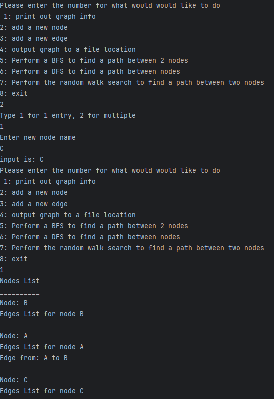

Project Part 3:
1) Refractors done:
   1. Extract Method - I had constantly reused code that stored characters from my parsed lines in an array list, I changed this to a method callend findWords
   2. Extract Method - I also had reused code for reading new lines, which I changed to a separate new method called readALine
   3. Extract Method - I also had some code that was consistently being used in a while loop that was if statements, so I made it into a method called checkType
   4. Extract Method - I reused a lot of comparisons for the separate expected tokens in parseGraph, so I made a method called typeOfInput that could be called continuously and return an int that
   aligns with the token read most recently
   5. Extract Method - I simply made an if statement that would choose between my DFS and BFS and copied and pasted the code into the if and else, so I put both into separate methods called BFS and DFS

2) I applied the template pattern by creating the class Search, which is an abstract class that holds all  the shared methods between BFS and DFS. The three main things that were in common between
the two were the initialization, obtaining the neighbors of nodes, and the management of the path when exploring the neighbors found. Since one uses a queue and one uses a stack, I decided to use
a list, and simply add to the BFS from the end of it and to the front for the DFS. This matches the FIFO and LIFO nature of both while still reusing code. This took place in the exploreNeighbors
method, as I used this difference to achieve the correct stack and queue properties of both using the same code. The getNeighbors method was the exact same for both, as that method simply finds all
the available neighbors of the current node. Finally, initialization was the same for both, as I used the same data structures for both algorithms. The BFS and DFS classes' main difference is the
search algorithm, which is somewhat similar between both, but I decided to keep separate due to the fields and local variables needed.

3) I applied the strategy pattern by creating an interface call Strategy that works as the strategy context. This lets the context interact with the strategy without breaking encapsulation, as the
interface I made requires the user to use it to initialize either the BFS or DFS objects. These are from the last step, and store the rest of the strategy pattern. This keeps the whole system
encapsulated, and lets the user interact with it without breaking this.

Project Part 2:
Continuous integration - as I did not have this set up for the last project, I set it up for this one

Features Available - In order from project part 1 to 3
Project part 1: using Commit1Test1.dot as input
Feature 1: parsing graph and toString functionality

Feature 2: adding nodes ot imported graph

Feature 3: adding edges to imported graph

Feature 4: Output imported graph to dot file or graphics

project part 2: using Commit1Test1.dot as input for feature 1 and 2, and input.dot from project part 3 for feature 3 and 4
Feature 1: Remove node or nodes

Feature 2: Remove edge

Feature 3: BFS

Feature 4: DFS

project part 3: using input1.dot as input
Feature 1: Random Walk Search - showing randomness between two attempts as requested

How to use:
1) start by entering the command "mvn dependency:copy-dependencies -DoutputDirectory=lib" to double check dependencies
2) enter the command"mvn clean compile"
3) enter the command "mvn package"
4) enter the command  " java -cp target/test-1.0-SNAPSHOT.jar:lib/* org.example.Main"
5) follow the commands inside of the program
